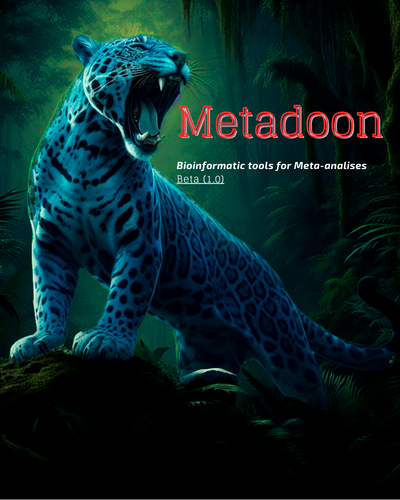

# 🧪 Metadoon
# 🧪 Metadoon

<div align="center">
  
</div>


***Metadoon*** is a user-friendly graphical interface and pipeline designed for processing and analyzing amplicon-based metagenomic data using tools like VSEARCH and R (with Phyloseq). It automates the workflow from FASTQ preprocessing to statistical visualization in R.

---

## *📦 Major Dependencies*

| *Dependency* | *Version (Suggested)* | *Description* |
| --------------------------------------------------------- | --------------------- | ---------------------------------------------- |
| *[Python](https://www.python.org/downloads/)* | *3.12+* | *Main interface (Tkinter GUI, logic control)* |
| *[R](https://cran.r-project.org/)* | *4.4.3* | *Statistical analysis and plotting* |
| *[VSEARCH](https://github.com/torognes/vsearch/releases)* | *≥ 2.21.1* | *FASTQ processing (dereplication, clustering)* |

---

## *🐍 Python Dependencies (minor)*

*These packages are included in the Conda environment:*

| *Package* | *Purpose* |
| ---------- | ------------------------------------------------------ |
| *`tkinter`*| *GUI interface (Standard Python Library)* |
| *`Pillow`* | *Icon/image handling in Python* |

> \*Standard libraries used: **`os`**, **`sys`**, **`json`**, **`threading`**, **`subprocess`**, **`shutil`**, **`glob`**, **`datetime`**

---

## *📊 R Dependencies (minor)*

All packages listed below are automatically installed by the Conda environment.

### *📦 CRAN Packages*

* tidyverse, reshape2, igraph, foreach, lme4
* ggplot2, ggpubr, cowplot, dplyr, pheatmap, viridis
* ape, rprojroot, wesanderson, RColorBrewer

### *🧪 Bioconductor Packages*

* phyloseq, DESeq2, scater

### *🔧 GitHub Packages (installed post-env)*
# R
if (!requireNamespace("devtools", quietly = TRUE)) install.packages("devtools")
devtools::install_github("vlubitch/pairwiseAdonis")
devtools::install_github("microbiome/microbiome")
## *🛠️ System-Level Dependencies*

*These are installed via Conda or available on Unix-based systems:*

| *Tool/Library*                                           | *Description*                       |
| -------------------------------------------------------- | ----------------------------------- |
| `bash`, `wget`                                           | *Script automation and downloading* |
| `conda`, `mamba`                                         | *Environment management*            |
| `Rscript`                                                | *Execute R scripts via CLI*         |
| `libcurl`, `libxml2`                                     | *R package compilation*             |
| `openssl`, `zlib`, `gcc`, `make`, `libuv`, `gmp`, `mpfr` | *System/compiler libraries*         |

> *On macOS, **XQuartz** may be required for full R graphical support.*

---

## *🔗 Download Links*

* [Python](https://www.python.org/downloads/)
* [R](https://cran.r-project.org/)
* [VSEARCH](https://github.com/torognes/vsearch/releases)
* [Conda (recommended)](https://docs.conda.io/en/latest/)

---

## *🚀 Installation & Usage*

> ⚠️ *Note: All required folders such as `Output/`, `Metadata/`, `OTUs/`, `Taxonomy/`, and `Tree File/` are automatically created during the pipeline execution if they do not exist.*

1. *Clone this repository:*

   ```bash
   git clone https://github.com/rdo-adan/metadoon.git
   cd metadoon
   ```

2. *Create the Conda environment:*

   ```bash
   bash setup.sh
   ```

3. *Activate the Conda environment:*

   ```bash
   conda activate metadoon
   ```

4. *Run the GUI:*

   ```bash
   python metadoon.py
   ```

---
## ⚙️ Pipeline Workflow
Metadoon executes a standard amplicon analysis workflow:

Merge Pairs: Merges R1 and R2 FASTQ files using VSEARCH.

Quality Filter: Filters reads based on maximum expected error (fastq_maxee).

Dereplication: Identifies unique sequences to reduce computational load.

Clustering: Clusters sequences into OTUs (default 97% identity).

Chimera Removal: Removes chimeric sequences using both de novo and Reference-based detection.

Taxonomy Assignment: Assigns taxonomy using the SINTAX algorithm.

Statistical Analysis (R):

Rarefaction curves.

Alpha & Beta Diversity metrics.

Core Microbiome analysis.

Differential Abundance (DESeq2).

Analysis of Compositions of Microbiomes with Bias Correction (ANCOM-BC).

## *📁 Project Structure*
Before run:
```
Metadoon/
│
├── metadoon.py              # Main GUI script (Python)
├── Analise.R                # Statistical analysis script (R)
├── generate_report.R        # Report generation script
├── Metadoon_Report.Rmd      # RMarkdown template
├── pipeline_params.json     # Configuration file
├── metadoon_env.yaml        # Conda environment definition
└── setup.sh                 # Installation script
```
After Run
```
Metadoon/
│
├── DB/                      # Downloaded reference databases (RDP, Silva, etc.)
├── Metadata File/           # Stores the uploaded metadata file
├── Tree File/               # Stores the phylogenetic tree (if provided)
│
├── Merged/                  # Paired-end reads merged by VSEARCH
├── FullFiles/               # Concatenated merged reads
├── Filtered/                # Quality filtered sequences
├── Dereplicated/            # Unique sequences (dereplication)
│
├── OTUs/                    # Clustering results
│   ├── centroids.fasta      # OTU representative sequences
│   ├── otus.fasta           # Final OTUs (non-chimeric)
│   └── otutab.txt           # OTU abundance table
│
├── Taxonomy/                # Taxonomic classification results
│   ├── taxonomy_raw.txt     # Raw output from SINTAX
│   └── taxonomy.txt         # Cleaned taxonomy table for R
│
└── Output/                  # FINAL RESULTS
    ├── Plots (Alpha/Beta diversity, Heatmaps, Rarefaction)
    ├── Statistical Tables (DESeq2, PERMANOVA)
    └── Metadoon_Report.html # Complete HTML Summary
```
---

## *🗒️ How to Generate the Final Report
Inside the Metadoon interface, go to the "Tools" menu.

Click "Generate Final Report".

This will run the R script that creates a complete report with all plots, alpha and beta diversity results, PERMANOVA, DESeq2 outputs, and summary.

The report will be saved in the root folder as Metadoon_Report.html.

## *💾 How to Save All Results
Inside the interface, go to "Tools".

Click "Save and Clean Results".

You will be prompted to select a destination folder.

Metadoon will create a new folder named Metadoon_Results_YYYY-MM-DD_HH-MM-SS inside your selected directory.

It copies all critical outputs (Output/, OTUs/, Taxonomy/, Reports) to this safe location.

Optional Cleanup: After saving, the tool will ask if you want to delete the generated workspace folders (Merged, Filtered, DB, etc.) to free up disk space.

---

## *📬 Contact*

*For issues or questions, please open an issue or contact the maintainer.*

[rdo.adan@gmail.com](mailto:rdo.adan@gmail.com)
